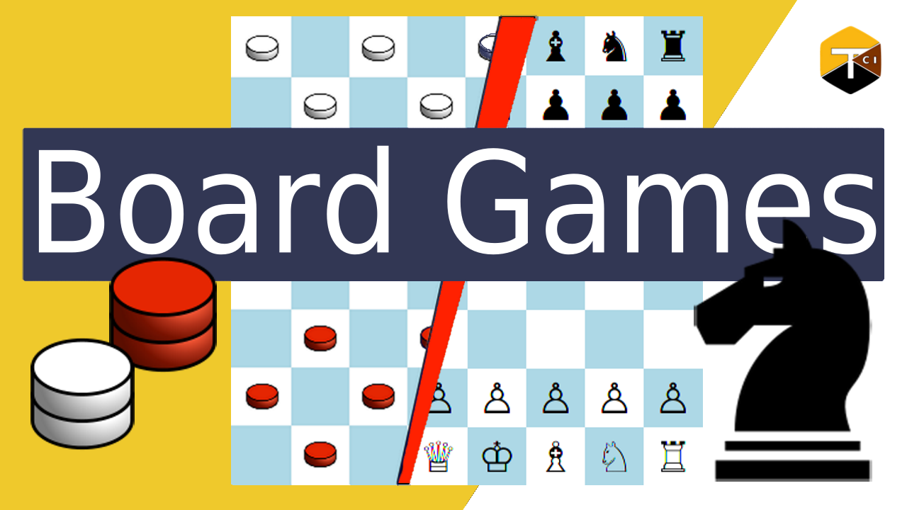

# board-games
Chess, checkers, etc in one application

[Application Overview (Youtube)](https://youtu.be/DTrA_wI4yWY) | [Tutorial Series (Youtube)](https://www.youtube.com/playlist?list=PLEj_WYZ-VQAMnzWmF9jssAQ9qXcgSza_5)

 
